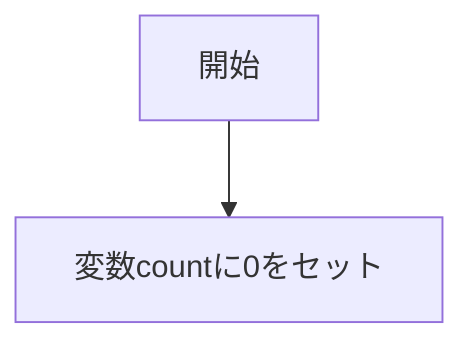
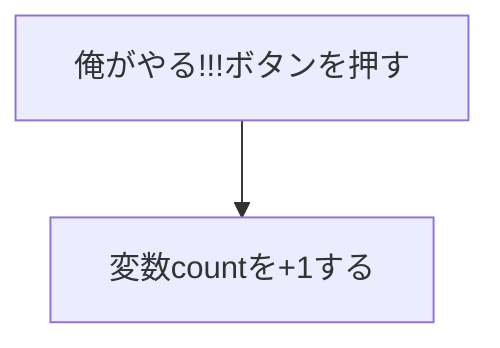
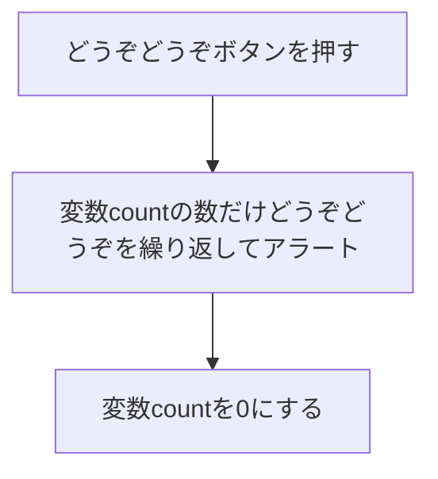
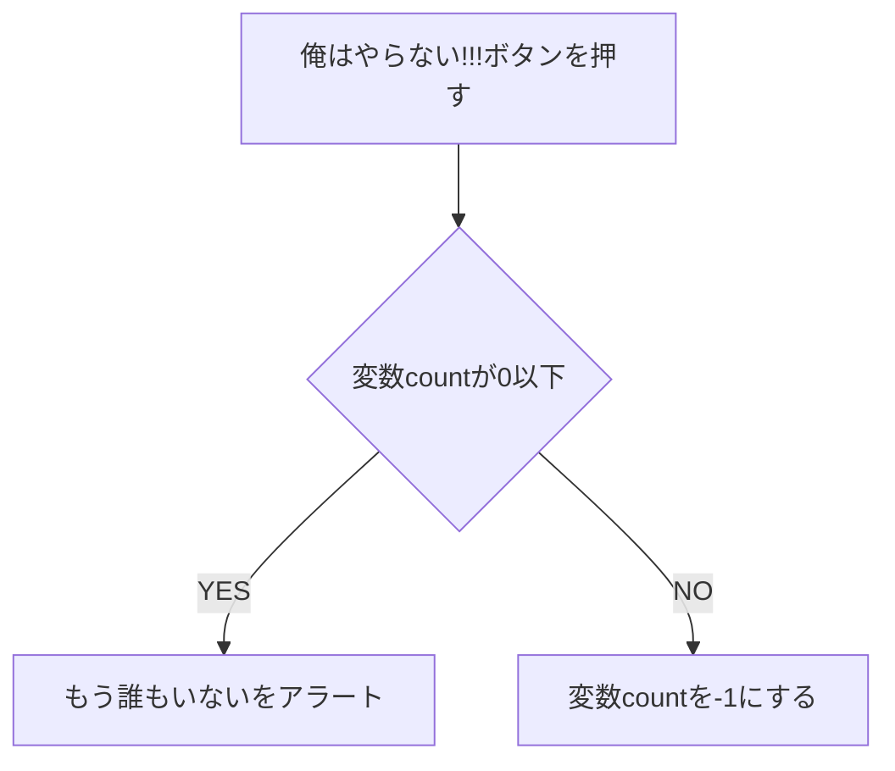

# ダチョウ倶楽部ゲーム

## 基本問題+チャレンジ問題
- 「俺がやる!!!」ボタンを押す。
- 押した数を数える。
- 「俺はやらない!!!」ボタンを押す
- 数が0以下なら、アラート「もう誰もいない、、、」を出し、終了。
- 押した数を-1引く。
- 「どうぞどうぞぉ～」ボタンを押す
- 数えた数分、アラートで“どうぞどうぞ”を表示する。
- 数をリセットする。

### 俺がやる!!!ボタンのクリックイベント

### どうぞどうぞボタンのクリックイベント

### 俺はやらない!!!ボタンのクリックイベント

