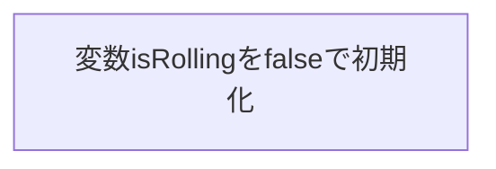
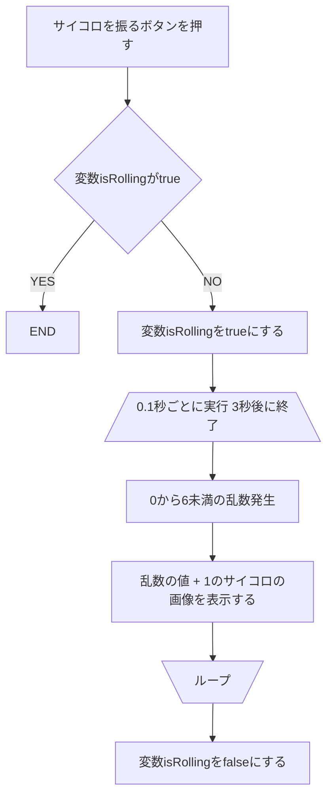
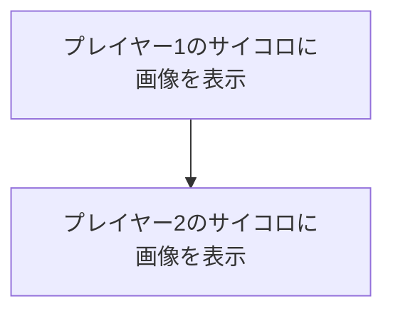
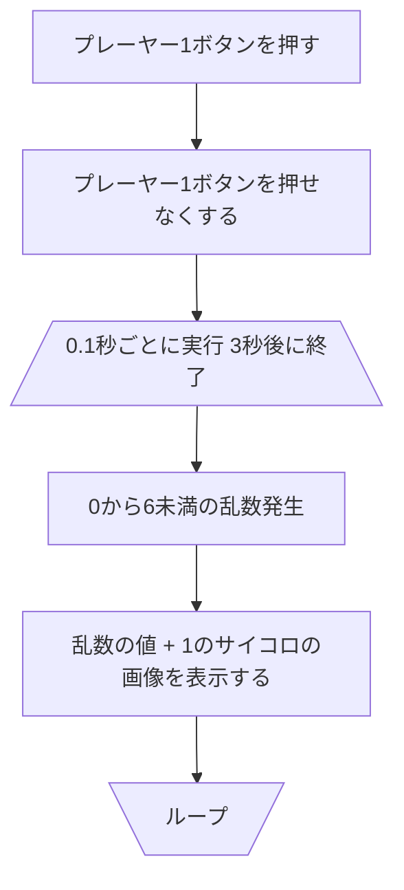
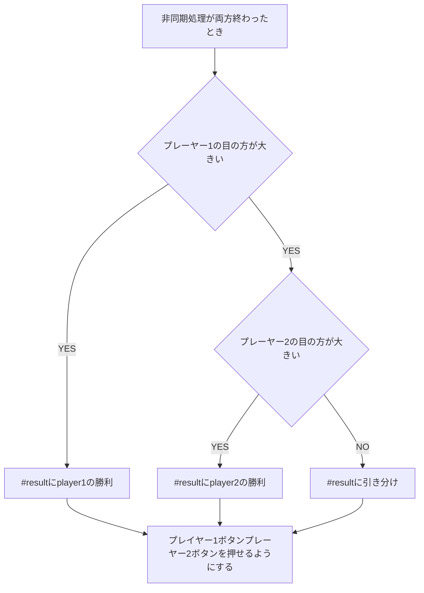

# サイコロアプリ

## 作るもの
- ボタンを押して 3 秒後にランダムで 1 からの 6 のサイコロの目の画像を表示するプログラム。 
※連続でボタンを押しても不自然な挙動が起こらないよう工夫する。

## 基本問題
- 変数isRollingをfalseで初期化。
- 「サイコロを振る」ボタンを押す
- 変数isRollingがtrueなら終了、falseならtrueにして処理継続
- 振ってるアニメーション
- 3秒後に1から6のサイコロの画像を表示する。
- 変数isRollingがfalseにする。

### グローバルオブジェクト

### 「サイコロを振る」ボタン

## 追加チャレンジ問題
- 「プレイヤー1」ボタンを押す
- 「プレーヤー1」ボタンを押せなくする。
- プレイヤー1のサイコロが振られ、3秒後に止まる(非同期)
- 「プレイヤー2」ボタンを押す。
- 「プレーヤー2」ボタンを押せなくする。
-  プレイヤー2のサイコロが振られ、3秒後に止まる(非同期)
- 両方のサイコロが止まったら、
  - #resultに
    - 「player1の勝利」(player1の目の方が大きい)
    - 「player2の勝利」
    - 「引き分け」
  - を表示する。
- 「プレイヤー1」ボタン「プレーヤー2」ボタンを押せるようにする。

### グローバルオブジェクト

### 「プレーヤー1」ボタン「プレーヤー2」ボタン

### 非同期処理が両方終わったとき

- #resultに
    - 「player1の勝利」(player1の目の方が大きい)
    - 「player2の勝利」
    - 「引き分け」
  - を表示する。
- 「プレイヤー1」ボタン「プレーヤー2」ボタンを押せるようにする。