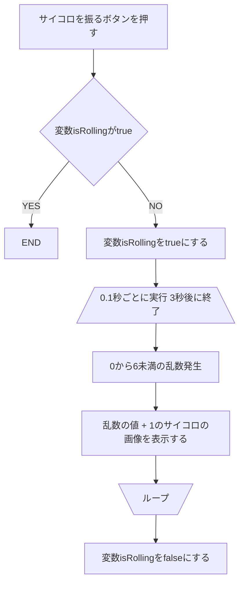

# サイコロアプリ

## 作るもの
- ボタンを押して 3 秒後にランダムで 1 からの 6 のサイコロの目の画像を表示するプログラム。 
※連続でボタンを押しても不自然な挙動が起こらないよう工夫する。

## 基本問題
- 変数isRollingをfalseで初期化。
- 「サイコロを振る」ボタンを押す
- 変数isRollingがtrueなら終了、falseならtrueにして処理継続
- 振ってるアニメーション
- 3秒後に1から6のサイコロの画像を表示する。
- 変数isRollingがfalseにする。

### グローバルオブジェクト

### 「サイコロを振る」ボタン

