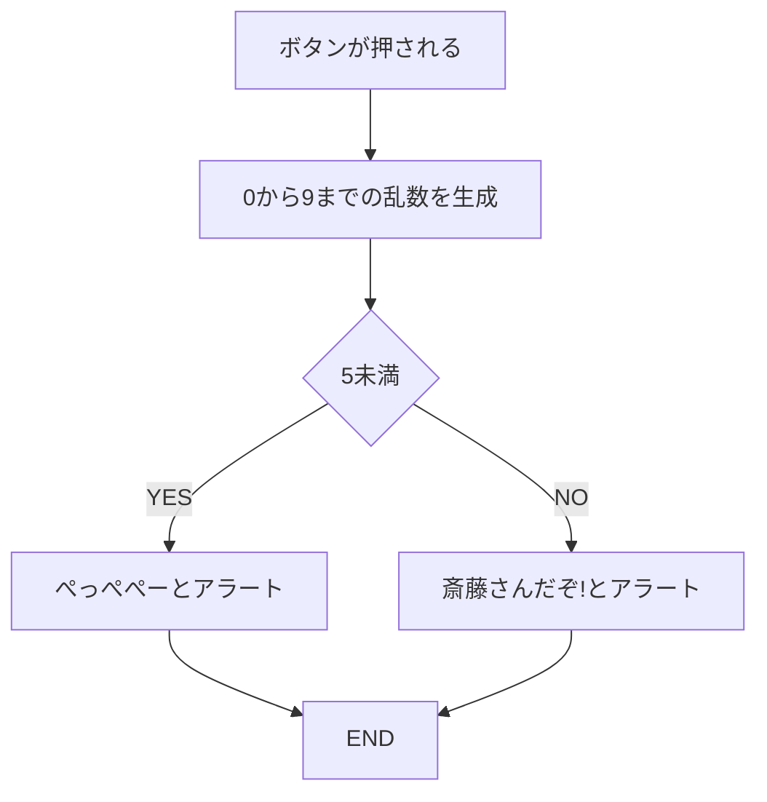
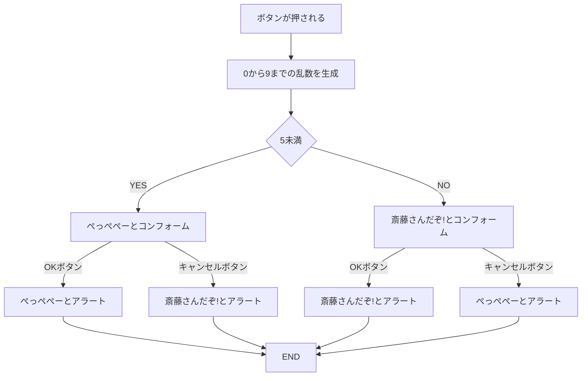

# 斎藤さんゲーム

## 基本問題
- ボタンが押される
- 0から9までの数字を1つ作る
- 0以上5未満の数字が出たら「ぺっぺぺー」とアラート
- それ以外の5以上10未満が出たら「斎藤さんだぞ！」とアラート

## 追加チャレンジ問題
- ボタンが押される
- 0から9までの数字を1つ作る
- 0以上5未満の数字が出たら「ぺっぺぺー」とコンフォーム
  - OKボタンなら「ぺっぺぺー」とアラート
  - キャンセルボタンなら「斎藤さんだぞ！」とアラート

- それ以外の5以上10未満が出たら「斎藤さんだぞ！」とコンフォーム
  - OKボタンなら「斎藤さんだぞ！」とアラート
  - キャンセルボタンなら「ぺっぺぺー」とアラート

